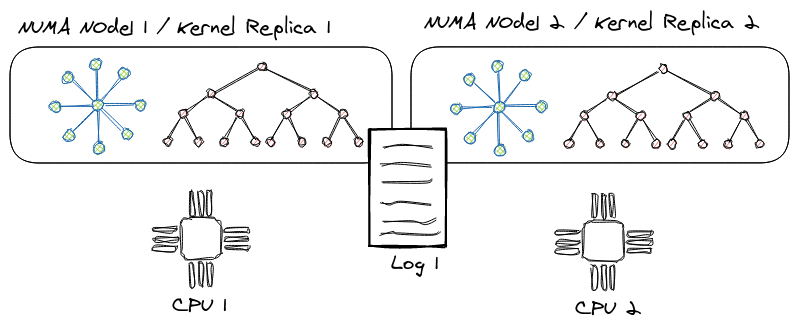

# Node Replicated Kernel?

Node Replicated Kernel (NRK) is a research prototype OS that is being developed
collaboratively by researchers at [VMware
Research](https://research.vmware.com/), [University of
Utah](http://utah.systems/), EPFL and University of British Columbia. It is
intended as a basis to explore ideas about the structure of operating systems
for hardware of the future. NRK is written from scratch, almost all in Rust
(with some assembly), and it runs on x86 platforms.

## How is NRK different from Linux, Windows, or MacOS?

At present, NRK lacks many of the features of an operating system that make
it usable by anyone other than systems researchers taking measurements of the
system itself. For example, there is currently no GUI or Shell, and only very
limited application support. In fact, it's probably easier to compare NRK in
it's current form to a light-weight hypervisor rather than a fully-featured OS.

From an architectural point of view, the NRK kernel is a new and practical
implementation of a [multi-kernel
OS](https://en.wikipedia.org/wiki/Multikernel):

> A multikernel operating system treats a multi-core machine as a network of
> independent cores, as if it were a distributed system. It does not assume
> shared memory but rather implements inter-process communications as
> message-passing.

Unfortunately, such a model also brings unnecessary complexity: For example,
[the "original" multi-kernel (Barrelfish)](http://www.barrelfish.org/) relied on
per-core communication channels and [complicated distributed
protocols](https://arxiv.org/abs/1911.08367) to achieve agreement, replication
and sharing in the OS.

[We overcome this complexity in NRK by using
logs](/architecture/KernelArchitecture.md): The kernel relies primarily on
single-threaded data structures which are automatically replicated in the
system. Various operation logs make sure the replicas are always synchronized.
Our technique (called [node-replication](./architecture/NodeReplication.md))
bears resemblance to state machine replication in distributed systems, and lifts
our single-threaded data-structures into linearizable, concurrent structures.
Our OSDI'21 paper has more details in what scenarios this approach can heavily
outperforms the scalability of traditional lock-based or lock-free
data-structures.

<figure>
  
  <figcaption>Schematic view of the NRK kernel. Core kernel data-structures are replicated in
the system with a log.</figcaption>
</figure>

In user-space, NRK runs applications in [ring
3](https://en.wikipedia.org/wiki/Protection_ring): Each application can be
understood as a single isolated process/container/lightweight VM without means
to share state with other processes (aside from explicit communication through
the network). To run existing, well-known applications like
[memcached](benchmarking/Memcached.md), [LevelDB](benchmarking/LevelDb.md) or
[Redis](benchmarking/Redis.md), a process can link against
[rumpkernel](https://github.com/rumpkernel), which instantiates and runs the
[NetBSD](https://www.netbsd.org/) kernel and its user-space libraries (libc,
libpthread etc.) within the process' address-space and therefore adds decent
support for POSIX.

Finally, NRK is written from scratch in Rust: We take advantage of the use of
a safe language for OS implementation to gain better security and correctness
guarantees at compile time, while not impacting performance negatively.