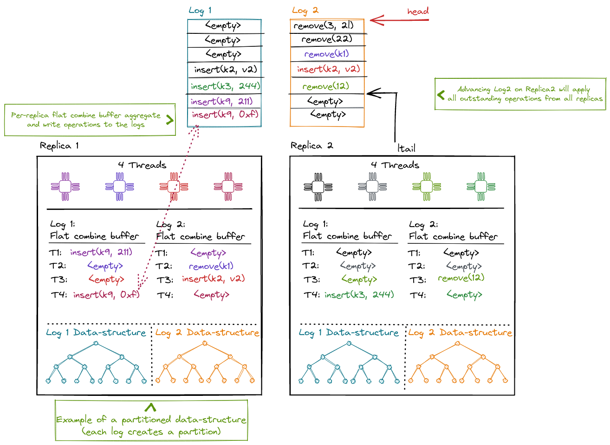

# Concurrent Node Replication (CNR)

Some OS subsystems can become limited by [node-replications
(NR)](./NodeReplication.md) single log if operations are frequently mutating
but would otherwise naturally commute.

NR allows multiple combiners from different replicas to make progress in
parallel, but its write-scalability is limited because

1. all combiner threads are operating on a single, shared log; and
2. each replica is a sequential data structure, which requires protection using a readers-writer lock.

To address these problems, we can use CNR, a technique that extends the original
NR approach by leveraging operation commutativity present in certain data
structures. Two operations are said to be *commutative* if executing them in
either order leaves the data structure in the same abstract state. Otherwise, we
say operations are *conflicting*.

As NR, CNR replicates a data structure across NUMA nodes and maintains the
consistency of the replicas. However, CNR uses commutativity to scale the single
NR shared log to multiple logs, by assigning commutative operations to different
logs, while ensuring that conflicting operations always use the same log and
thus have a total order. In addition, CNR can use concurrent or partitioned data
structures for replicas, which allows for multiple concurrent combiners on each
replica -- one for each shared log. This eliminates the per-replica
readers-writer lock and scales access to the data structure.

CNR lifts *an already concurrent data structure* to a NUMA-aware concurrent data
structure. The original data structure can be a concurrent (or partitioned) data
structure that works well for a small number of threads (4-8 threads) within a
single NUMA node. This data structure can be lock-free or lock-based and may
result in poor performance under contention. CNR produces a concurrent data
structure that works well for a large number of threads (e.g., 100s of threads)
across NUMA nodes, and that is resilient to contention.

<figure>
  
  <figcaption>

  In CNR a replica can distribute commuting operations among different logs.
  Each replica maintains one flat-combining buffer per log where operations are
  aggregated. One elected combiner thread commits all outstanding operation in a
  batch to the log and then applies the ops against the local data-structure.

  Compared to NR, the replicated data-structure is no longer protected by a
  single reader-writer lock by default. Instead, the data-structure can be
  partitioned (per-log) as in this diagram, use a lock-free approach, or rely on
  locking.
  </figcaption>
</figure>

## CNR Operations and Linearizability

CNR is useful for *search data structures*, with operations `insert(x)`,
`remove(x)`, `lookup(x)` and `range-scan(x, y)`. These operations often benefit
from commutativity, which depends both on the abstract operation type and on its
input arguments. Similar to [transactional
boosting](https://dl.acm.org/doi/10.1145/1345206.1345237), CNR considers the
abstract data type for establishing commutativity, not the concrete data
structure implementation.

Consider, for example, the `insert(x)` operation. Two operations are commutative
if they operate on distinct arguments: e.g., `insert(x)` and `insert(y)` are
commutative if `x != y`. A concrete implementation of the data structure could
be a sorted linked list. One might think that `insert(x)` and `insert(x+1)` are
not commutative because they operate on shared memory locations. However, the
original data structure already safely orders accesses to shared memory
locations, due to its concurrent nature. Hence, these operations commute for CNR
and can be safely executed concurrently.

## Interface

CNR's interface is similar to NR, but it adds *operation classes* to express
commutativity for the mutable and immutable operations. CNR relies on the
provided data structure to identify conflicting operations by assigning them to
the same operation class. CNR uses this information to allocate conflicting
operations to the same shared log and, if they execute on the same NUMA node, to
the same combiner too. In contrast, commutative operations can be executed by
different combiners and can use different shared logs, allowing them to be
executed concurrently.

As with NR, CNR executes different steps for mutating (update) and non-mutating
(read) operations. Each of these operations uses only one of the multiple logs
and is linearized according to its log's order. Different logs are not totally
ordered, but operations belonging to different logs are commutative.

In addition, CNR special-cases another type of operation, *scan*, which belongs
to more than one operation class. These are operations that conflict with many
other operations (e.g., a length operation has to read the entire data structure
to determine the size). If we assign this operation to a single class, all other
operations need to be in the same class, eliminating the commutativity benefit.

Scan-type operations span multiple logs and need a *consistent state* of the
replica across all the logs involved in the operation, obtained *during the
lifetime of the scan operation*. To obtain a consistent state, the thread
performing the scan collects an atomic snapshot of the log tails by inserting
the operation in these logs. This atomic snapshot becomes the scan's
linearization point.

We show the CNR API, with the additional traits implemented for expressing
operation classes [using our earlier example in the NR
section](NodeReplication.html#source-and-code-example):

```rust
use chashmap::CHashMap;
use cnr::{Dispatch, LogMapper};

/// The replicated hashmap uses a concurrent hashmap internally.
pub struct CNRHashMap {
   storage: CHashMap<usize, usize>,
}

/// We support a mutable put operation on the hashmap.
#[derive(Debug, PartialEq, Clone)]
pub enum Modify {
   Put(usize, usize),
}

/// This `LogMapper` implementation distributes the keys amoung multiple logs
/// in a round-robin fashion. One can change the implementation to improve the
/// data locality based on the data sturucture layout in the memory.
impl LogMapper for Modify {
   fn hash(&self, nlogs: usize, logs: &mut Vec<usize>) {
      debug_assert!(logs.capacity() >= nlogs, "guarantee on logs capacity");
      debug_assert!(logs.is_empty(), "guarantee on logs content");

      match self {
         Modify::Put(key, _val) => logs.push(*key % nlogs),
      }
   }
}

/// We support an immutable read operation to lookup a key from the hashmap.
#[derive(Debug, PartialEq, Clone)]
pub enum Access {
   Get(usize),
}

/// `Access` follows the same operation to log mapping as the `Modify`. This
/// ensures that the read and write operations for a particular key go to
/// the same log.
impl LogMapper for Access {
   fn hash(&self, nlogs: usize, logs: &mut Vec<usize>) {
      debug_assert!(logs.capacity() >= nlogs, "guarantee on logs capacity");
      debug_assert!(logs.is_empty(), "guarantee on logs content");

      match self {
         Access::Get(key) => logs.push(*key % nlogs),
      }
   }
}

/// The Dispatch traits executes `ReadOperation` (our Access enum)
/// and `WriteOperation` (our Modify enum) against the replicated
/// data-structure.
impl Dispatch for CNRHashMap {
   type ReadOperation = Access;
   type WriteOperation = Modify;
   type Response = Option<usize>;

   /// The `dispatch` function applies the immutable operations.
   fn dispatch(&self, op: Self::ReadOperation) -> Self::Response {
       match op {
           Access::Get(key) => self.storage.get(&key).map(|v| *v),
       }
   }

   /// The `dispatch_mut` function applies the mutable operations.
   fn dispatch_mut(&self, op: Self::WriteOperation) -> Self::Response {
       match op {
           Modify::Put(key, value) => self.storage.insert(key, value),
       }
   }
}
```

CNR is available as a stand-alone rust library together with the NR code [on
github](https://github.com/vmware/node-replication/).

## Comparison to NR and Notation

CNR benefits from the NR techniques, such as flat combining and operation logs
with a succinct operation description, which reduce contention and inter-NUMA
synchronization.

As NR, CNR has two drawbacks: increased memory footprint and increased
computational cost from re-executing each operation on each replica. CNR has
similar footprint to NR, because the single shared log can be split into
multiple, smaller shared logs. However, CNR increases parallelism within each
NUMA node by using a concurrent replica with multiple combiners and increases
parallelism across NUMA nodes by using multiple (mostly) independent shared
logs.
