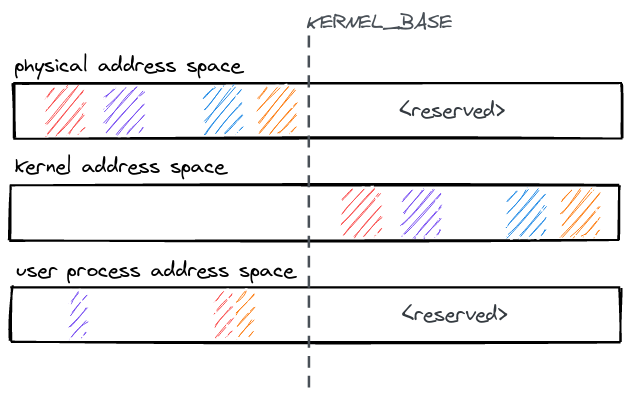
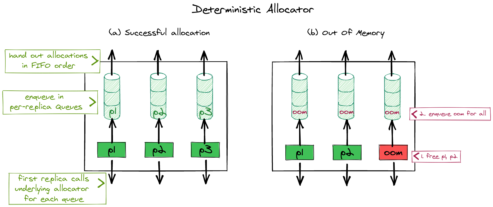

# Memory

## Kernel address space

The kernel address space layout follows a simple scheme: All physical memory is
identity mapped with a constant offset `KERNEL_BASE` in the kernel address
space. Therefore, any physical address can be accessed in the kernel by adding
`KERNEL_BASE` to it.

All physical memory is always accessible in the kernel and does not need to
mapped/unmapped at runtime. The kernel binary is linked as position independent
code, it is loaded into physical memory and then relocated to run at the kernel
virtual address (`KERNEL_BASE` + physical address).

<figure>
  
  <figcaption>
    A view of different address spaces in nrk (physical, kernel, user).
  </figcaption>
</figure>

## Physical memory

Physical memory allocation and dynamic memory allocation for kernel data
structures are two basic subsystems that do not rely on NR. Replicated
subsystems often require physical frames, but that allocation operation itself
should not be replicated. For example, when installing a mapping in a page
table, each page table entry should refer to the same physical page frame on all
replicas (though, each replica should have its own page tables). If allocator
state were replicated, each allocation operation would be repeated on each
replica, breaking this.

At boot time, the affinity for memory regions is  identified, and memory is
divided into per-NUMA node caches (FrameCacheLarge). The FrameCacheLarge statically partitions
memory further into two classes of 4 KiB and 2 MiB frames. Every core has a
local FrameCacheSmall of 4 KiB and 2 MiB frames for fast, no-contention allocation when
it contains the requested frame size. If it is empty, it refills from its local
FrameCacheLarge. Similar to slab allocators, NRK' FrameCacheSmall and FrameCacheLarge implement a cache
frontend and backend that controls the flow between TCaches and NCaches.

<figure>
  
  <figcaption>
    Shows a global per-NUMA FrameCacheLarge and a per-core FrameCacheSmall. Cores allocate 4K or 2M
    pages directly from the FrameCacheSmall which may refill from the FrameCacheLarge when empty (grow).
    TCaches and NCaches both hold frames in stacks to allows for quick allocation
    and deallocation of frames.
  </figcaption>
</figure>

## Dynamic memory

Since NRK is implemented in Rust, memory management is greatly simplified by
relying on the compiler to track the lifetime of allocated objects. This
eliminates a large class of bugs (use-after-free, uninitialized memory *etc.*),
but the kernel still has to explicitly deal with running out of memory. NRK
uses fallible allocations and intrusive data structures to handle out-of-memory
errors gracefully.

The dynamic memory allocator in nrk provides an implementation for the [Rust
global allocator
interface](https://doc.rust-lang.org/std/alloc/trait.GlobalAlloc.html). It uses
size classes and different allocators per class (*e.g.,* it's a
segregated-storage allocator), while incorporating some of the simple and
effective ideas from slab allocation: For each size class, 2MiB or 4 KiB frames
are used which are sliced into equal sized objects of a given class. A bitfield
at the end of every frame tracks the meta-data for objects within the frame
(*e.g.,* to determine if its allocated or not).

<figure>
  
  <figcaption>
    The dynamic memory allocator for kernel objects in nrk. It shows an allocator
    containing two frames for less than 16 byte objects. Each frame contains
    a few allocated slots along with per-frame meta-data (prev, next pointer) and
    metadata to indicate allocated blocks. Typically, one dynamic memory allocator
    per core is instantiated.
  </figcaption>
</figure>

## Deterministic memory

The kernel has to explicitly handle running out of memory. nrk uses fallible
allocations to handle out-of-memory errors gracefully by returning an error to
applications. We do this in almost all cases in the kernel (with some exceptions
during initializations etc.) but some of the 3rd party dependencies (e.g., to
parse ELF binaries) are not completely converted to fallible allocations yet.

Another issue is that handling out-of-memory errors in presence of replicated
data-structures becomes a little more challenging: Allocations which happen to
store replicated state must be deterministic (e.g. they should either succeed on
all replicas or none). Otherwise, the replicas would end up in an inconsistent
state if after executing an operation, some replicas had successful and some had
unsuccesful allocations. Making sure that all replicas always have equal amounts
of memory available is infeasible because every replica replicates at different
times and meanwhile allocations can happen on other cores for unrelated reasons.
We solve this problem in nrk by requiring that all memory allocations for state
within NR or CNR must go through a deterministic allocator. In the deterministic
allocator, the first replica that reaches an allocation request allocates memory
on behalf of all other replicas too. The deterministic allocator remembers the
results temporarily, until they are picked up by the other replicas which are
running behind. If an allocation for any of the replica fails, the leading
replica will enqueue the error for all replicas, to ensure that all replicas
always see the same result. Allocators in nrk are chainable and it is sufficient
for the deterministic allocator to be anywhere in the chain so it doesn't
necessarily have to be invoked for every fine-grained allocation request. Our
implementation leverages custom allocators in Rust, which lets us override which
heap allocator is used for individual data-structures.

<figure>
  
  <figcaption>
    The deterministic memory allocator generally forwards allocation requests to the underlying
    memory allocator. However, the first request on any replica will allocate on behalf
    of all other replicas and store the results temporarily in a set of queues (one per replica).
    The deterministic allocator ensures that either (a) all replicas will have a successful allocations
    for a given request or (b) none and they all get "null" as a result back.
  </figcaption>
</figure>
