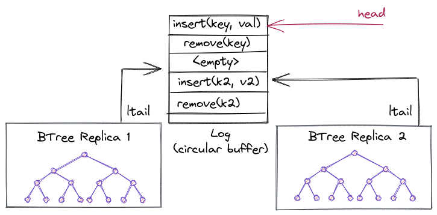
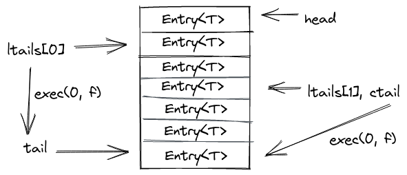
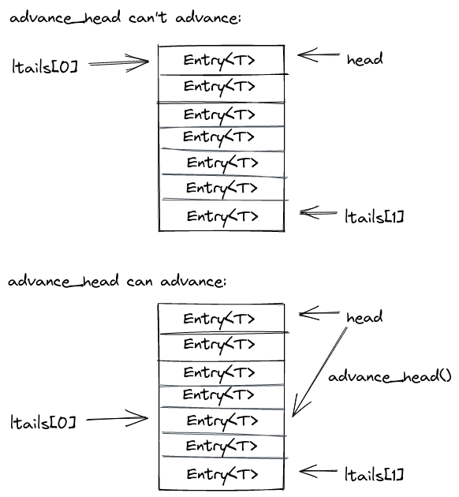
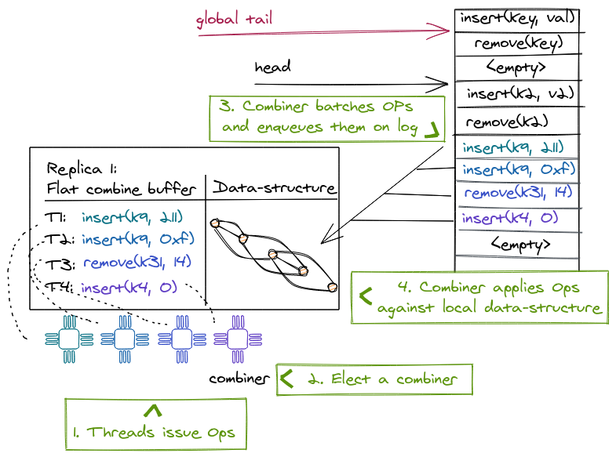

# Node Replication (NR)

NR creates linearizable NUMA-aware concurrent data structures from black-box
sequential data structures. NR replicates the sequential data structure on each
NUMA node and uses an operation log to maintain consistency between the
replicas. Each replica benefits from read concurrency using a readers-writer
lock and from write concurrency using a technique called *flat combining*. In a
nutshell, flat combining batches operations from multiple threads to be executed
by a single thread (*the combiner*). This thread also appends the batched
operations to the log; other replicas read the log to update their internal
states with the new operations.

Next, we explain in more detail the three main techniques that NR makes use of:
operation logs, scalable reader-writer locks and flat combining.

## The operation log

The log uses a circular buffer to represent the abstract state of the concurrent
data structure. Each entry in the log represents a mutating operation, and the
log ensures a total order. The *log tail* gives the index to the last
operation added to the log.

A replica can lazily consume the log by maintaining a per-replica index into the
log, indicating how far from the log the replica has been updated. The log is
implemented as a circular buffer, so that entries can be garbage collected and
reused. NR cannot garbage collect entries that have not been applied on each
replica. This means at least one thread on each NUMA node must be executing
operations on the data structure, otherwise the log can fill up and other
replicas would not be able to make any more progress.

<figure>
  
  <figcaption>
  Shows a log containing mutable operations for a 2x replicated BTree. Each
  replica contains a local tail (ltail1 and ltail2) pointer into the log. A
  global head tracks the oldest entry that is still outstanding (i.e., needs to
  be consumed by at least one more replica before it can be overwritten).
  </figcaption>
</figure>

Next, we're going to explain the log in more detail for the curious reader
(Warning: if you're not directly working on this, likely these subsections are
pretty boring and can be skipped as well).

### Log memory layout

<figure>
  
  <figcaption>
  The log structure and it's members as they appear in memory.
  </figcaption>
</figure>

[The
log](https://github.com/vmware/node-replication/blob/b9871ddf423fd48e6a1558da83a7aa0fa7f5fda6/nr/src/log.rs)
contains an array or slice of entries, `slog`, where it stores the mutable
operations from the replicas. It also maintains a global `head` and `tail` which
are a subregion in `slog`, and indicate the current operations in the log that
still need to be consumed by at least one replica or have not been garbage
collected by the log. The `head` points to the oldest "active" entry that still
needs to be processed, and the `tail` to the newest. All replicas have their own
`ltail` which tracks per-replica progress. At any point in time, an `ltail` will
point somewhere in the subregion given by `head..tail`. `lmasks` are generation
bits: they are flipped whenever a replica wraps around in the circular buffer.

`next` is used internally by the library to hand out a registration tokens for
replicas that register with the log (this is done only in the beginning, during
setup). It tracks how many replicas are consuming from/appending to the log.

The `ctail` is an optimization for reads and tracks the max of all `ltails`:
e.g., it points to the log entry (`< tail`) after which there are no completed
operations on any replica yet.

### Consuming from the log

The [`exec`
method](https://github.com/vmware/node-replication/blob/b9871ddf423fd48e6a1558da83a7aa0fa7f5fda6/nr/src/log.rs#L471)
is used by replicas to execute any outstanding operations from the log. It takes
a closure that is executed for each outstanding entry, and a token to identify
the replica that calls `exec`.

Approximately, the method will do two things:

1. Invoke the closure for every entry in the log which is in the sub-region
   `ltail..tail` and afterwards sets `ltail = tail`.
1. Finally, it may update the `ctail` if `ltail > ctail` to the new maximum.

<figure>
  
  <figcaption>
  Indicates what happens to ltail[0] and ctail when replica 0 calles exec(): The
  ltail will be updated to be equal to tail and the ctail (currently pointing to
  the old max which is ltail[1] will point to a new max which is the same as
  tail and ltail[0]). Of course it also applies all the entries between ltail[0]
  and tail against the data-structure of replica 0.
  </figcaption>
</figure>

### Appending to the log

[The append
operation](https://github.com/vmware/node-replication/blob/b9871ddf423fd48e6a1558da83a7aa0fa7f5fda6/nr/src/log.rs#L341)
is invoked by replicas to insert mutable operations into the log. It takes a
slice of new operations coming from the replica and the same closure as in
`exec` to potentially apply some outstanding operations. This is necessary as
the log could be full and unable to insert more operations. Then, we'd first
have to update our own ltail a bit (or wait for other replicas to make
progress).

Approximately, the method will end up doing these steps:

1. If there isn't enough space to insert our new batch of operations, try to
   consume some entries from the log until we have enough space available.
1. Do a compare exchange on the log `tail` to reserve space for our entries.
1. Insert entries into the log
1. See if we can collect some garbage aka old log entries no longer used ([next section](#garbage-collecting-the-log)).

### Garbage collecting the log

[`advance_head`](https://github.com/vmware/node-replication/blob/b9871ddf423fd48e6a1558da83a7aa0fa7f5fda6/nr/src/log.rs#L534)
has the unfortunate job to collect the log garbage. Luckily this amounts to as
little as periodically advancing the head pointer.

For that it computes the minium of all `ltails`. If this minimum still ends up
being the current head, it waits (and calls `exec` to try and advance its local
tail). Once the min ltail is bigger than the head, it will update the head to
that new minimum ltail and return.

<figure>
  
  <figcaption>
  Shows the two possible scenarios in advance head: In the top diagram, the tail
  of replica 0 points to the current head, so we can't advance the head pointer
  and need to wait. In the bottom diagram, both ltail[0] and ltail[1] have
  progressed further than head, so we don't need the entries between
  head..ltail[0] anymore, and so head is advanced.
  </figcaption>
</figure>

## Flat combining

NR uses [flat combining](https://dl.acm.org/doi/10.1145/1810479.1810540) to
allow threads running on the same socket to share a replica, resulting in better
cache locality both from flat combining and from maintaining the replica local
to the node's last-level cache.

1) The combiner can batch and combine multiple operations, resulting in a lower
   overall cost than executing each operation individually. For example,
   removing items from a priority queue can be done with a single atomic
   instruction for the whole batch instead of one atomic instruction for each
   operation.

2) A single thread accesses the data structure for multiple consecutive
   operations, ensuring cache locality for the whole batch of operations.

NR also benefits from combining operations placed on the log; the combiner does
so using a single atomic operation for the whole batch instead of one atomic
instruction per operation.

<figure>
  
  <figcaption>
  Flat combining multiple operations from threads on the same replica: A
  combiner thread is elected who will aggregate outstanding operations from all
  threads (1, 2), put them on the log in one batch (3) and then execute them
  against the local replica (4), after executing any previously outstanding
  operations.
  </figcaption>
</figure>

## The optimized readers-writer lock

NR uses a writer-preference variant of the [distributed RW
lock](http://www.1024cores.net/home/lock-free-algorithms/reader-writer-problem/distributed-reader-writer-mutex)
to ensure the correct synchronization of the combiner and reader threads when
accessing the sequential replica.

Each reader acquires a local per-thread lock; the writer has its own writer lock
to indicate to the readers its intent to acquire the writer lock. A reader first
checks the writer lock and then acquires its local lock if there is no writer;
then it checks the writer lock again (while holding the lock) and releases the
reader lock if it notices the writer declared its intent to acquire the lock
(writer preference). The combiner also acquires the writer lock before modifying
the replica. Thus, we give highest priority to the writer, because we don't want
to delay update operations. This lock allows readers to read a local replica
while the combiner is writing a batch of operations to the log, increasing
parallelism.

If there is no combiner, a reader might have to acquire the writer lock to
update the replica from the log to avoid a stale read, but this situation is
rare.

<figure>
  
  <figcaption>
   The RWLock used to protect the data-structure in every Replica. It uses
   multiple, cache-line sized atomic booleans for reader threads and a single
   bool for a writer thread. It allows concurrent readers but only a single
   writer (the elected combiner). Readers also have to make sure to advance the
   replica with the latest entries from the log.
  </figcaption>
</figure>


## A concurrent non-mutating operation (read)

A non-mutation operation (read) can execute on its thread's local replica,
without creating a log entry, but it needs to ensure that the replica is not
stale. To do so, it takes a snapshot of the log tail when the operation begins,
and waits until a combiner updates the replica past the observed tail, or
acquires the lock and updates the replica.

If there is no combiner, the read thread will acquire the writer lock and update
the replica.

## A concurrent mutating operation (update)

A thread T executing a mutating operation (update) needs to acquire the combiner
lock. If the thread T executing this operation fails to acquire it, another
thread is a combiner already and T spin-waits to receive its operation's result
from the existing combiner.

However, T must still periodically attempt to become the combiner, in case the
prior combiner missed T's operation.

If T acquires the lock, it becomes *the combiner* and executes all update
operations of the concurrent threads on the same replica. To do so, T appends
its operations to the shared log with a single atomic operation and ensures that
the replica is up to date, before executing the operations and returning their
results to the waiting threads.

# Source and code example

[Node-replication
(NR)](https://github.com/vmware/node-replication/tree/master/nr) is released as
a stand-alone library.

To give an idea, here is an example that transforms an single-threaded
hash-table (from the Rust standard library) into a concurrent, replicated
hash-table:

```rust
//! A minimal example that implements a replicated hashmap
use std::collections::HashMap;
use node_replication::Dispatch;
use node_replication::Log;
use node_replication::Replica;

/// The node-replicated hashmap uses a std hashmap internally.
#[derive(Default)]
struct NrHashMap {
    storage: HashMap<u64, u64>,
}

/// We support mutable put operation on the hashmap.
#[derive(Clone, Debug, PartialEq)]
enum Modify {
    Put(u64, u64),
}

/// We support an immutable read operation to lookup a key from the hashmap.
#[derive(Clone, Debug, PartialEq)]
enum Access {
    Get(u64),
}

/// The Dispatch traits executes `ReadOperation` (our Access enum)
/// and `WriteOperation` (our `Modify` enum) against the replicated
/// data-structure.
impl Dispatch for NrHashMap {
    type ReadOperation = Access;
    type WriteOperation = Modify;
    type Response = Option<u64>;

    /// The `dispatch` function applies the immutable operations.
    fn dispatch(&self, op: Self::ReadOperation) -> Self::Response {
        match op {
            Access::Get(key) => self.storage.get(&key).map(|v| *v),
        }
    }

    /// The `dispatch_mut` function applies the mutable operations.
    fn dispatch_mut(&mut self, op: Self::WriteOperation) -> Self::Response {
        match op {
            Modify::Put(key, value) => self.storage.insert(key, value),
        }
    }
}
```

As we can see we need to define two operation enums (`Modify` for mutable
operations that end up on the log, and `Access` for immutable/read operations).
Afterwards we need to implement the `Dispatch` trait from NR for our newly
defined data-structure that mainly is responsible to route the operations
defined in `Access` and `Modify` to the underlying data-structure. [The full
example](https://github.com/vmware/node-replication/blob/master/nr/examples/hashmap.rs),
including how to create replicas and a log can be found in the NR repository.