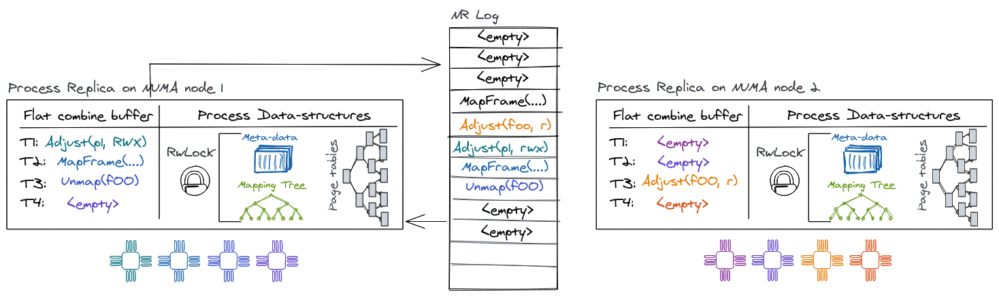

# Process structure

## Virtual memory

NRK relies on the MMU for isolation. Like most conventional virtual memory
implementations, NRK uses a per-process mapping database (as a B-Tree) to
store frame mappings which is used to construct the process's hardware page
tables. NRK currently does not support demand paging. Both the B-Tree and the
hardware page tables are simple, sequential data structures that are wrapped
behind the NR interface for concurrency and replication.

Therefore, the mapping database and page tables are replicated on every NUMA
node, forming the biggest part of the process abstraction. A process exposes the
following mutating operations to modify its address space: `MapFrame` (to
insert a mapping); `Unmap` (to remove mappings); and `Adjust` (to change
permissions of a mapping). The virtual memory system also supports a
non-mutating `Resolve` operation (that advances the local replica and queries
the address space state).

<figure>
  
  <figcaption>
   Schematic diagram of a node-replicated process in NRK.
  </figcaption>
</figure>

### Virtual memory and NR

There are several aspects of the virtual-memory design that are influenced by
its integration with NR:

For example, the virtual-memory has to consider out-of-band read accesses by
cores' page table walkers. Normally a read operation would go through the NR
interface, ensuring replay of all outstanding operations from the log first.
However, a hardware page table walker does not have this capability. A race
arises if a process maps a page on core X of replica A and core Y of replica B
accesses that mapping in userspace before replica B has applied the update.
Luckily, this can be handled since it generates a page fault. In order to
resolve this race, the page-fault handler advances the replica by issuing a
`Resolve` operation on the address space to find the corresponding mapping of
the virtual address generating the fault. If a mapping is found, the process can
be resumed since the `Resolve`-operation will apply outstanding operations. If
no mapping is found, the access was an invalid read or write by the process.

`Unmap` or `Adjust` (*e.g.,* removing or modifying page-table entries) requires
the OS to flush TLB entries on cores where the process is active to ensure TLB
coherence. This is typically done in software, by the OS, and commonly referred
to as performing a TLB shootdown. The initiator core will start by enqueuing the
operation for the local replica. After NR returns we know that the unmap (or
adjust) operation has been performed at least against the local page-table
replica and is enqueued as a future operation on the log for other replicas.
Next, we send inter-processor interrupts (IPIs) to trigger TLB flushes on all
cores running the corresponding process. As part of the IPI handler the cores
will first acknowledge the IPI to the initiator, next they must make sure to
advance their local replica with outstanding log operations (which forces the
unmap/adjust if not already applied), then poll a per-core message queue to get
information about the regions that need to be flushed, and finally perform the
TLB invalidation. Meanwhile the initiator will invalidate its own TLB entries
and then wait for all outstanding acknowledgments from other cores before it can
return to user-space.
